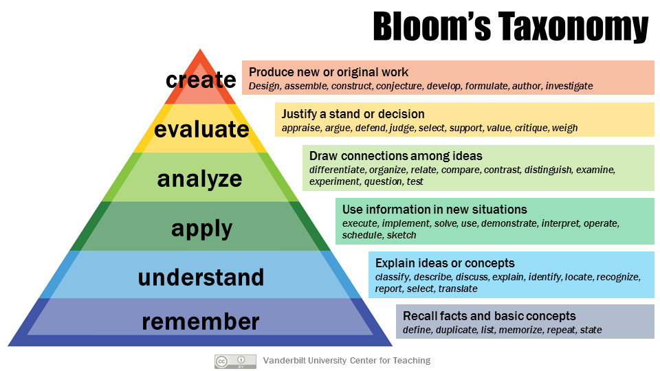

# 8: Make it stick

## Learning tips for students

1. **Retrieval practice**
  - when reading, pause periodically to ask questions: what are the key ideas? what terms or ideas are new? how would I define them? how do these relate to what I already know?
  - Interval self quizzes
1. **Spaced practice**
  - studying more than once but leaving considerable time between practice sessions
  - Establish a schedule for self-quizzing
  - Anything you want to remember must be periodically recalled from memory.
1. **Interleaved practice**
  - Interleave the study of different problem types
  - Blocked practice is not as effective
  - Quiz yourself of various problem types and retrieving the appropriate solutions for each
  - Instead of doing the same thing, change it up, mix in the practice of other subjects, other skills, constantly challenging your ability to recognise the problem type and select the right solution
  - Mixing up problem types improves ability to discriminate between types, identify the unifying characteristics within a type, and improves later success
1. **Elaboration**
  - Process of finding additional layers of meaning in new material
  - For example: relating to things I already know, explaining it to someone else in our own words, explaining how it relates to your life outside of class
  - The more that you can elaborate on how new learning relates to what you already know, the stronger your grasp of the new learning will be, and the more connections you create to remember it later
1. **Generation**
  - An attempt to answer a question or solve a problem before being shown the answer or the solution
  - Many people perceive their learning is most effective when it is experiential—that is, learning by doing rather than by reading a text or hearing a lecture. Experiential learning is a form of generation
  - Practice generation when reading new class materials by trying to explain beforehand the key ideas you expect to find in the material and how you expect they will relate to your prior knowledge
  - As a result of having made the initial effort, you will be more astute at gleaning the substance and relevance of the reading material, even if it differs from your expectation.
  - If you’re in a science or math course learning different types of solutions for different types of problems, try to solve the problems before you get to class.
1. **Reflection**
  - The act of taking a few minutes to review what has been learned in a recent class or experience and asking yourself questions. What went well? What could have gone better? What other knowledge or experiences does it remind you of?
  - What might you need to learn for better mastery, or what strategies might you use the next time to get better results?
1. **Calibration**
  - The act of aligning your judgments of what you know and don’t know with objective feedback so as to avoid being carried off by the illusions of mastery that catch many learners by surprise at test time.
  - Mistaking fluency with a text for mastery of the underlying content is just one example of cognitive illusion.
  - Example: pilots use flight instruments to know when their perception is misleading them
1. **Mnemonic devices**
  - Like memory castles

### Story: Michael Young

- Slower but more deliberate reading with self-quizzing
- Instead of long hours for re-reading he tried retrieval practice
- Deciding what's important to practice
- Making yourself answer the questions
- Finding the right interval for spaced practice
- Slowing down to find meaning

### Timothy Fellows

> - Always does the reading prior to a lecture. 
> - Anticipates test questions and their answers as he reads. 
> - Answers rhetorical questions in his head during lectures to test his retention of the reading. 
> - Reviews study guides, finds terms he can’t recall or doesn’t know, and relearns those terms. 
> - Copies bolded terms and their definitions into a reading notebook, making sure that he understands them. 
> - Takes the practice test that is provided online by his professor; from this he discovers which concepts he doesn’t know and makes a point to learn them. 
> - Reorganizes the course information into a study guide of his design. 
> - Writes out concepts that are detailed or important, posts them above his bed, and tests himself on them from time to time. 
> - Spaces out his review and practice over the duration of the course. 

## Tips for lifelong learners

1. **Retrieval practice**
  - Story: Nathaniel Fuller, actor
2. **Generation**
  - Story: writers's block
  - Creating a lot without criticism and thinking that it should be good

    > Without the drafted version—if it did not exist—you obviously would not be thinking of ways to improve it. In short, you may actually be writing only two or three hours a day, but your mind, in one way or another, is working on it twenty-four hours a day—yes, while you sleep—but only if some sort of draft or earlier version exists. Until it exists, writing has not really begun.”
3. **Reflection**
  - Story: Vice Dooley, Georgie Bulldogs football coach uses reflection and mental rehearsal to improve game strategies
  - Story: Chesley Sullenberger: US Airways flight 1549 that landed in the Hudson River in 2009
4. **Elaboration**
  - Story: Thelma Hunter, pianist, individual interpretations and deliberate practice

## Tips for teachers

**Explain to students how learning works**, for example:

> - Some kinds of difficulties during learning help to make the learning stronger and better remembered.  
> - When learning is easy, it is often superficial and soon forgotten.
> - Not all of our intellectual abilities are hardwired. In fact, when learning is effortful, it changes the brain, making new connections and increasing intellectual ability.  
> - You learn better when you wrestle with new problems before being shown the solution, rather than the other way around.
> - To achieve excellence in any sphere, you must strive to surpass your current level of ability.
> - Striving, by its nature, often results in setbacks, and setbacks are often what provide the essential information needed to adjust strategies to achieve mastery.

- Teach students how to study
- Create desirable difficulties in the classroom, for example frequent quizzes to consolidate learning and interrupt the process of forgetting
- Create study tools that incorporate retrieval practice, generation, and elaboration
- Make quizzing and practice exercises count toward the course grade
- Design quizzing and exercises to reach back to concepts and learning covered earlier
- Space, interleave and vary topics and problems

**Be transparent**

- Help students understand the ways you incorporated desirable difficulties into lessons.
- Be upfront about some of the possible frustrations and why this is valuable

### Bloom's revised taxonomy of learning objectives

- Remember
  - Recognizing
  - Recalling
- Understand
  - Interpreting
  - Exemplifying
  - Classifying
  - Summarizing
  - Inferring
  - Comparing
  - Explaining
- Apply
  - Executing
  - Implementing
- Analyze
  - Differentiating
  - Organizing
  - Attributing
- Evaluate
  - Checking
  - Critiquing
- Create
  - Generating
  - Planning
  - Producing

  Ref: https://cft.vanderbilt.edu/guides-sub-pages/blooms-taxonomy/ or https://www.ncbi.nlm.nih.gov/pmc/articles/PMC4511057/
  
### Story: Mary Pat Wenderoth, Biology Prof.

Her techniques:

- **Transparency**
- **Testing groups** - where students wrestle with questions together, without opening a textbook, to figure it out together. Emphasis on exploration and understanding

  > Wenderoth will ask students in a testing group what ideas they don’t feel really clear on. Then she’ll send one student to the whiteboard to try to explain the concept. As the student struggles, perhaps putting up the pieces of the answer she knows, the rest of the group are instructed to test her by asking questions whose answers will lead her to the larger concept
- **Free recall** - 10 minutes at the end of each day, recall on a piece of blank paper. After 10 minutes, they can go over the notes to check what they remember and what they forgot
- Summary sheets - illustrate prior's week material in drawings annotated with key ideas, arrows, and graphs
- **Learning paragraphs** - prepare a 5-6 sentence response to a question
- **Bloom's taxonomy of learning** - When students get their tests back, they also receive the answer key and are asked to identify where their answers fell on the taxonomy and to think about what they need to know in order to respond at a higher level of learning.
- **Closing the achievement gap in the sciences** - teaching kids how to learn

### Story: Michael D Matthews, Psychology Prof, West Point

Thayer method - named after superintendent Sylvanus Thayer. The method provides very specific learning objectives for every course, puts the responsibility for meeting those objectives on the student, and incorporates quizzing and recitation in every class meeting.

> The point is not to "slide your eyes over the words." You start with questions, and you read for answers.

- No lecture.
- Read materials beforehand
- Use class time for quizzes and group work

> These are higher-order questions than are given in the daily quiz, requiring the students to integrate ideas from the reading and apply them at a conceptual level. It’s a form of retrieval practice, generation, and peer instruction.

### Story: Kathleen McDermott, Psychology Prof

- Daily low-stakes quizzes

> Anything covered in the course to date is fair game for a quiz, and she will sometimes draw from past material that she feels the students haven’t fully grasped and need to review.

## Tips for Trainers

Less structured and non-classroom settings

- In-service training
  - Get a copy of the presentation materials and use them to quiz yourself on the key ideas
  - Schedule follow up emails to appear with questions on critical learning

### Story: Kathy Maixner, business coach

> “If you hand people the solution, they don’t need to explore how you got to that solution. If they generate the solution, then they’re the ones who are traveling down that road. Should they go left or right? We discuss the options.”

She often uses role-playing to simulate problems, getting her clients to generate solutions, try them out, get feedback, and practice what works

--
> We have talked throughout this book about learning, not about education. The responsibility for learning rests with every individual, whereas the responsibility for education (and training, too) rests with the institutions of society. Education embraces a world of difficult questions. Are we teaching the right things? Do we reach children young enough? How should we measure outcomes? Are our young people mortgaging their futures to pay for a college degree?